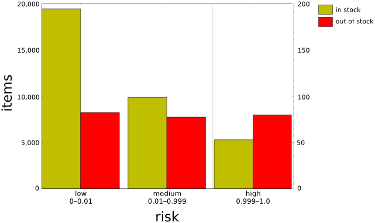
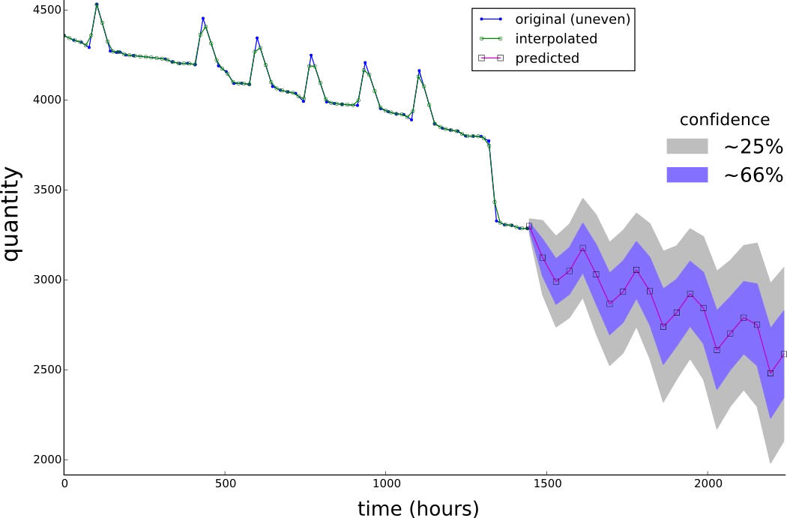
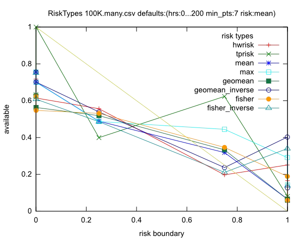
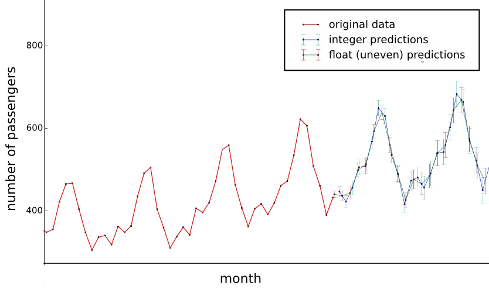
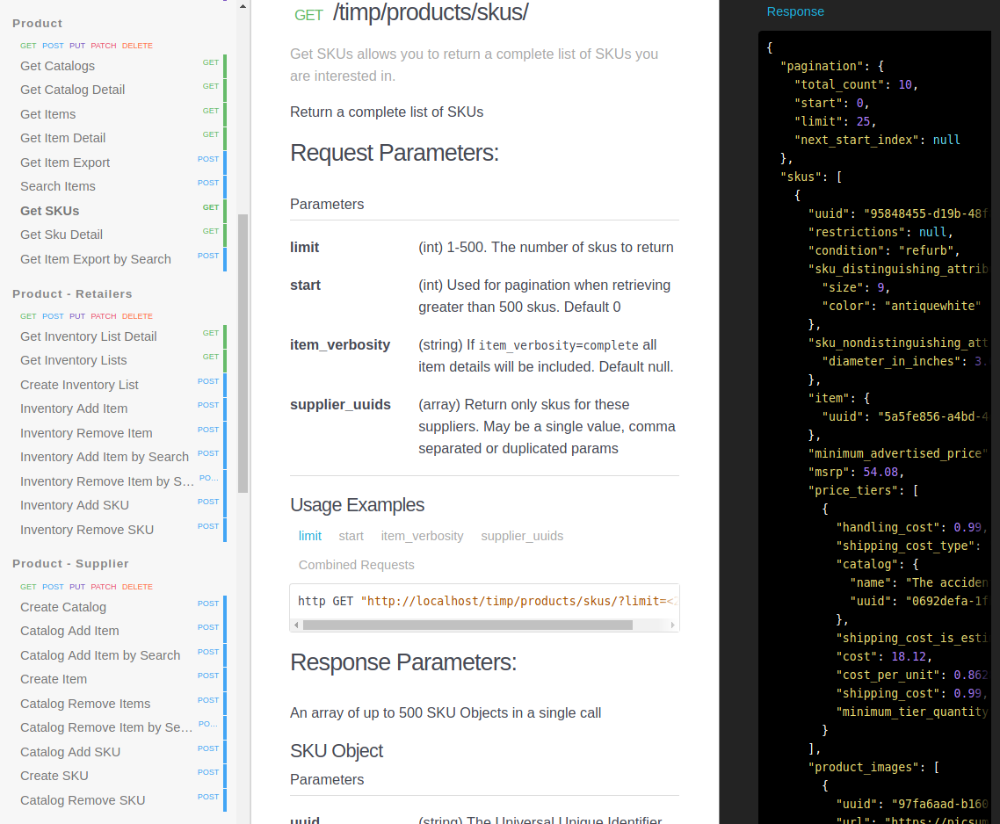
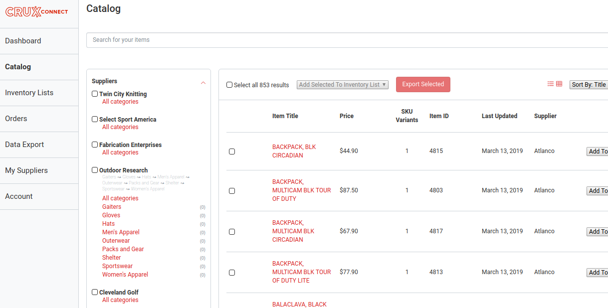
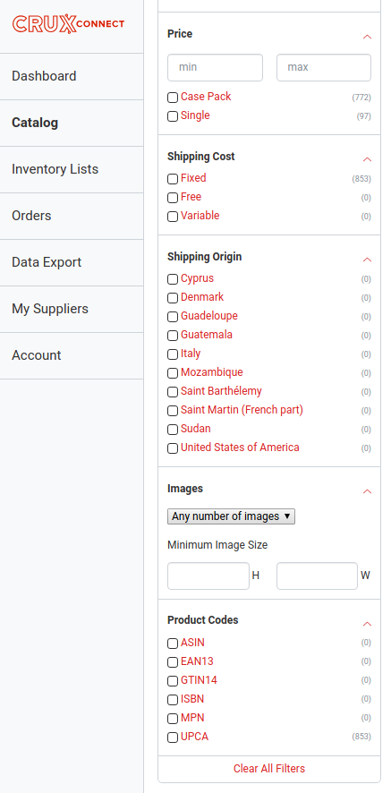

# John T. Prince

Simple demonstration and brief descriptions of some significant or interesting projects.  Unless noted, all data visualizations are my work.

See also my [Software Development and Data Analysis Philosophy](https://github.com/jtprince/portfolio/blob/master/philosophy.md) and [Favorite Tools](https://github.com/jtprince/portfolio/blob/master/favorite_tools.md)

## Out of Stock Risk

Developed custom Holt-Winters (triple exponential) forecasting:

* Custom algorithmic development:
    * can handle non-uniform data
    * heuristic to select optimal seasonalities
    * integrate with probabilistic model to better predict low count data
* Implemented in python/numpy/scipy
* *Currently in production use at Doba Inc*

[in-house project presentation](https://www.dropbox.com/s/k5niyn4kwm1jwze/OOS_Risk_Presentation.pdf?dl=0)

<table border="0">
<tr>
<td></td>

<td></td>
</tr>

<tr>
<td></td>

<td></td>
</tr>
</table>

## RESTful architecture

Co-designed the Crux-Connect RESTful interface.

See [docs.cruxconnect.com](docs.cruxconnect.com) for public endpoints. I assisted with creation of the jekyll documentation, but I designed and built all the endpoints described by the documentation.

## Stateful Elasticsearch-based Search

Architected entire elasticsearch search for product and autocompletion.

Created stateful faceted and filtered search.  The entire UI (which I did not
build) was driven by the data returned from stateful API calls.

* Dozens of unique filters and facets
* Handles complete category heirarchy
* Custom analyzers and normalizers for intuitive text search
* Dual text/keyword indexing for text search and keyword-based sorting

## Rubabel

## SimpleR (Ruby rserve wrapper)

## Obiwarp
