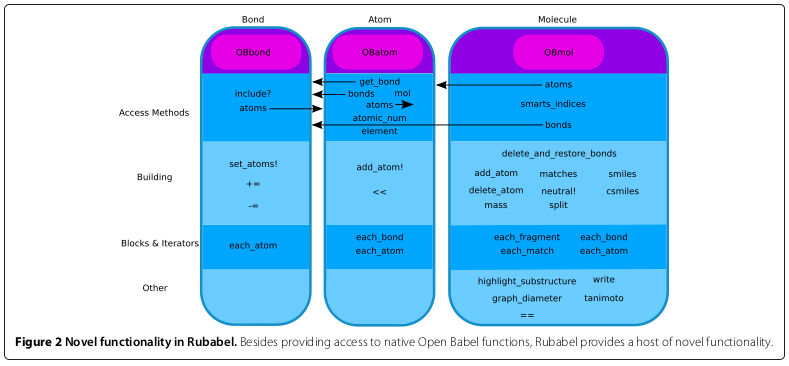
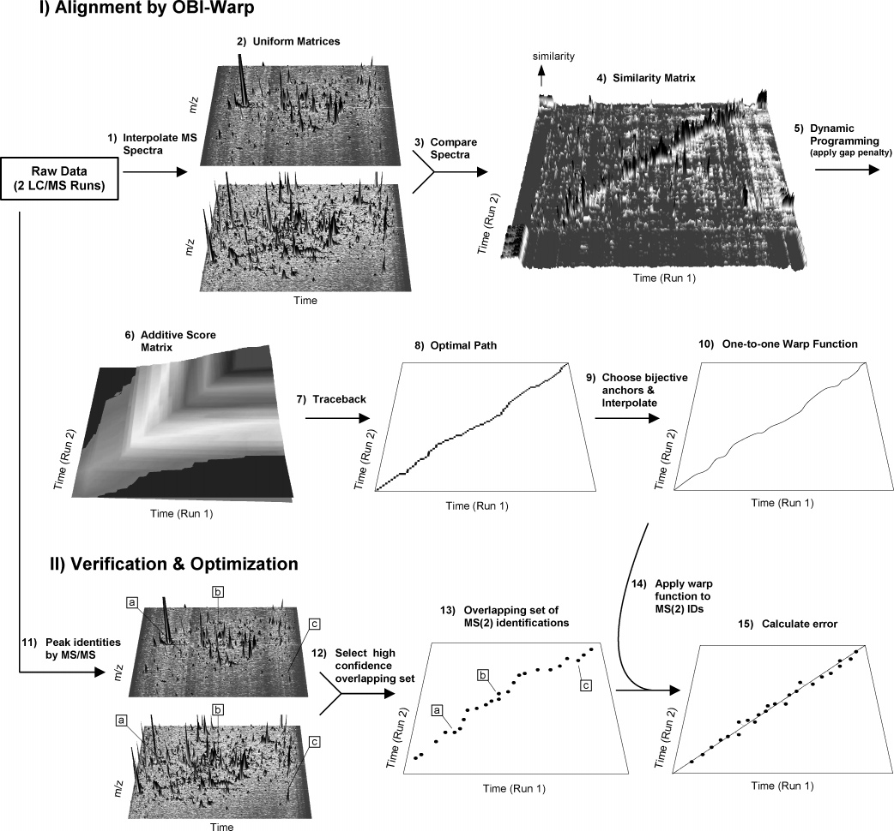
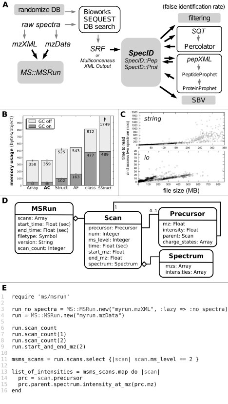

# John T. Prince

* [curriculum vitae](http://tiny.cc/jtprince-cv)
* [résumé](http://tiny.cc/jtprince-resume)
* [code examples](https://github.com/jtprince/portfolio/blob/master/code_examples.md)

* [github](https://github.com/jtprince) / [prince laboratory github](https://github.com/princelab)
* [publications on pubmed](http://tiny.cc/jtprince-publications) (34 total; 21 peer reviewed computational or algorithmic publications)
* [princelab projects](https://docs.google.com/viewer?url=https://github.com/jtprince/portfolio/raw/a74287187c579ff5f820934473d704e81ca318d4/media/prince-lab/The_Prince_Lab.pdf)

* [software development and data analysis philosophy](https://github.com/jtprince/portfolio/blob/master/philosophy.md)
* [favorite tools](https://github.com/jtprince/portfolio/blob/master/favorite_tools.md)

---

# Representative Projects

## Out of Stock Risk

Developed custom Holt-Winters (triple exponential) forecasting:

* Custom algorithmic development:
    * can handle non-uniform data
    * heuristic to select optimal seasonalities
    * integrate with probabilistic model to better predict low count data
* Implemented in python/numpy/scipy
* *Currently in production use at Doba Inc*

[in-house project presentation](https://www.dropbox.com/s/k5niyn4kwm1jwze/OOS_Risk_Presentation.pdf?dl=0)

<table border="0">
<tr>
<td><a href="media/oos-risk/categories.png"></a></td>

<td><a href="media/oos-risk/final-example.png"></a></td>
</tr>

<tr>
<td><a href="media/oos-risk/integration-types.png"></a></td>

<td><a href="media/oos-risk/nonuniform-data.png"></a></td>
</tr>
</table>

## RESTful architecture

Co-designed the Crux-Connect RESTful interface.

See [docs.cruxconnect.com](docs.cruxconnect.com) for public endpoints. I only assisted with creation of the jekyll documentation, but I designed and built all the endpoints described in the image below (and others not in the image).

<a href="media/restful-architecture/sku-example.png"></a>

## Stateful Elasticsearch-based Search

Architected entire Elasticsearch-based search for product, catalog, inventory lists, and autocompletion.

Created stateful faceted and filtered search.  All of the logic of the core of the entire catalog search UI (which I did not build) was driven by the data I returned from these stateful API responses.

* Over a dozen or so unique filters and facets, many requiring different state logic.
* Handles complete category heirarchy
* Custom analyzers and normalizers for intuitive text search
* Dual text/keyword indexing for text search and keyword-based sorting

<a href="media/stateful-search/basic-search-interface.png"></a>

<a href="media/stateful-search/more-filters.png"></a>

## HydrogenBondifier

Generic ruby interface with pymol and a script to determine hydrogen bond characteristics useful for hydrogen exchange mass spectrometry experiments.

[HydrogenBondifier](https://github.com/jtprince/hydrogen_bondifier) (github)

## MSabundanceSIM

Took my collaborator's algorithmic sketches and fashioned a complete software package in ruby.  Generated case and control "samples" (molecule and abundance lists) with reasonable variance modeled after one or more real world examples. (This was a recent off-hours personal project)

* [MSabundanceSIM](https://github.com/jtprince/MSabundanceSIM) (github)
* [J. Proteome Research, 2017, 16:2429–34](https://pubs.acs.org/doi/pdf/10.1021/acs.jproteome.7b00037)

## Rubabel

Wrapped Open Babel (cheminformatic model toolkit) with ruby.  The image below was generated by my student, but I was responsible for the design and code for the vast majority of the library.

[Journal of Cheminformatics 2013 5:35](https://jcheminf.biomedcentral.com/articles/10.1186/1758-2946-5-35)

<a href="media/rubabel/object-model.png"></a>

## rserve-simpler

Convenient interface to Rserve (a binary R server) for ruby.

[rserve-simpler](https://github.com/jtprince/rserve-simpler) (github)

## ruby histogram

Histogram solution for ruby featuring auto-bin and various bin methods (Scott, Sturges, FD), multiple datasets, and weights.

Suggested and then accepted as answer to [this stack overflow question](https://stackoverflow.com/questions/19101167/how-to-create-a-histogram-from-a-flat-array-in-ruby).

[histogram](https://github.com/jtprince/histogram) (github)

## Obiwarp

Dynamic programming and bijective warping solution for chromatographic alignment of complex LC-MS datasets.

* [Analytical Chemistry 2006 78:6140-52](https://pubs.acs.org/doi/abs/10.1021/ac0605344) ([alternate link](https://www.dropbox.com/s/natjcxrha9w0m0y/obiwarp.pdf?dl=0))
* Default method in XCMS ([retcor.obiwarp](https://rdrr.io/bioc/xcms/man/retcor.obiwarp-methods.html))

<a href="media/obiwarp/obiwarp.png"></a>

## Mspire - Mass Spectrometry Proteomics in Ruby

* MS and proteomic object models for ruby
* Direct access to data in large, binary indexed xml files.
* Reverse engineered the closed .srf format.

<a href="media/mspire/mspire.png"></a>

## Django-gtin-fields

Provides django model fields to store and validate commonly used GTIN related product identifiers (like UPC).

[django-gtin-fields](https://github.com/CruxConnect/django-gtin-fields) (github)

## Markdown documentation with ascii network diagrams

Created a simple tool [markdown-convert-raw-tables-and-graphs.py](https://github.com/jtprince/dotfiles/blob/master/bin/markdown-convert-raw-tables-and-graphs.py) (quick prototype) to aid in rapidly documenting workflows using markdown (in this case, supplier integration workflows).  The script converts labeled code blocks (easy to specify) into markdown-compatible output which is both human readable *and* interpretable by github and most markdown parsers.

### Jsontable

Tables are specified in `jsontable` codeblocks which are then transformed into markdown tables.

    ```jsontable
    [{
        "Step Name":  "_get_item",
        "Description": "use SOAP and produce json",
        "Tool Used": "python",
        "Script Name": "`get_inventory.py`",
        "Next Step": "send erazor*_prod*.json to _map_item"
    },
    {
        "Step Name":  "_map_item",
        "Description": "convert their Items into crux csv",
        "Tool Used": "python",
        "Script Name": "map_product_definition.py",
        "Next Step": "send erazor*_crux_prod*.csv to _blessed_product_feed"
    }]

    ```

Which then creates:

    ```
    | Step Name | Description                       | Tool Used | Script Name               | Next Step                                            |
    | --------- | --------------------------------- | --------- | ------------------------- | ---------------------------------------------------- |
    | _get_item | use SOAP and produce json         | python    | `get_inventory.py`        | send erazor*_prod*.json to _map_item                 |
    | _map_item | convert their Items into crux csv | python    | map_product_definition.py | send erazor*_crux_prod*.csv to _blessed_product_feed |
    ```

The markdown formatted table is interpreted by github, so it appears like this:

| Step Name | Description                       | Tool Used | Script Name               | Next Step                                            |
| --------- | --------------------------------- | --------- | ------------------------- | ---------------------------------------------------- |
| _get_item | use SOAP and produce json         | python    | `get_inventory.py`        | send erazor*_prod*.json to _map_item                 |
| _map_item | convert their Items into crux csv | python    | map_product_definition.py | send erazor*_crux_prod*.csv to _blessed_product_feed |

### Dot graph language

Network flow diagrams can be specified inside code blocks using the dot graph language:

    ```dot
    digraph items {
        "🐍 _get_item" -- "erazorbits" [label="SOAP API call"];
        "⏰ jobber" -> "🐍 _get_item" [label="cron_start.txt"];
        "🐍 _get_item" -> "🐍 _map_item" [label="erazorbits_item.json"];
        "🐍 _map_item" -> "𝟀 _blessed_product_feed" [label="erazorbits_crux_item.csv"];
    }
    ```

The script pipes the dot notation through graph-easy to generate ascii tables:


```
                                +---------------------------+
                                |         ⏰ jobber          |
                                +---------------------------+
                                  |
                                  | cron_start.txt
                                  v
+------------+  SOAP API call   +---------------------------+
| erazorbits | ---------------- |        🐍 _get_item        |
+------------+                  +---------------------------+
                                  |
                                  | erazorbits_item.json
                                  v
                                +---------------------------+
                                |        🐍 _map_item        |
                                +---------------------------+
                                  |
                                  | erazorbits_crux_item.csv
                                  v
                                +---------------------------+
                                |  𝟀 _blessed_product_feed  |
                                +---------------------------+
```

## State machine citation parsing

State machine parsing to efficiently extract citations from large ascii doc dataset (recent off-hours personal contribution to open-source project).

[extract_sources.rb](https://github.com/wordtreefoundation/book-of-mormon/blob/master/src/extract_sources.rb)

```ruby
...
  state_machine :state, initial: :in_verses do
    event :start_margin do
      transition :in_verses => :in_margin
    end

    event :end_margin do
      transition :in_margin => :in_verses
    end

    event :start_source do
      transition :in_margin => :in_source
    end

    event :end_source do
      transition :in_source => :in_margin
    end

    state :in_margin do
      def parse(line)
        if line == END_MARGIN
          if @source_lines.size > 0 && @source_lines.any? {|line| !line.strip.empty? }
            @sources.push(*Source.many_from_lines(@source_lines))
            @source_lines = []
          end
          end_margin
        elsif line == SOURCE_DELIMITER
          @source_lines = []
          start_source
        else
          @source_lines << line
        end
      end
    end
...
```
