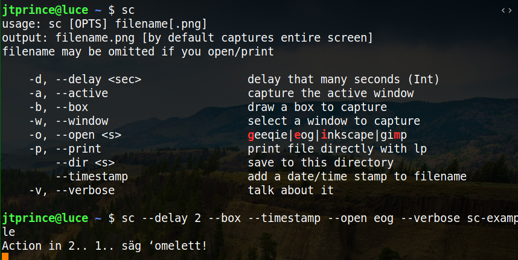

# Selected Code Examples

I've written dozens of packages (many quite extensive) for different languages (e.g., Ruby and Python) and hundreds of scripts.  Most of them can be found at [my github page](https://github.com/jtprince) or [my lab's github page](https://github.com/princelab).

Like any programmer, I can almost always critique, and hopefully improve, my own code.  Some of the code below is clean and single-purpose with good names and organization.  Some of it could be improved--mainly shorter methods with a single-purpose per method.  In general, I strive to write "clean code" using the transcendent principles discussed in books like [Clean Code](https://www.amazon.com/Clean-Code-Handbook-Software-Craftsmanship/dp/0132350882) (by Robert "Uncle Bob" Martin).

Click on the topic heading to be taken directly to code (where available).  The projects are sorted generally from small and simple to large and complex (and more technical).

### [Django-gtin-fields](https://github.com/CruxConnect/django-gtin-fields)

I've written a ton of python code for Doba and CruxConnect over the past 4.5 years, but almost all of it is proprietary.  I was given permission to open-source this package, which is solid, though fairly unexciting python/django code.

Interesting features: concise/readable UPCA -> UPCE conversion that improves somewhat upon existing implementations.

* [validators.py](https://github.com/CruxConnect/django-gtin-fields/blob/master/gtin_fields/validators.py)
* [converters.py](https://github.com/CruxConnect/django-gtin-fields/blob/master/gtin_fields/converters.py)

### [Screenshot](https://github.com/jtprince/dotfiles/blob/master/bin/sc)

Simple, high-level control over screenshots in 90 lines of source code.

### [Rserve-simpler](https://github.com/jtprince/rserve-simpler)

Wrapper around the fairly performant Rserve library for binary communication with an R server.  Example usage in [mspire-lipid](https://github.com/princelab/mspire-lipid/blob/master/lib/mspire/lipid/search/probability_distribution.rb).

### [MSabundanceSIM](https://github.com/jtprince/MSabundanceSIM)

My collaborator, Rob Smith (a National Science Career Award recipient and CS professor at the University of Montana) , had written some idea code  and asked for my help making it production ready. I refactored and polished it up a bit and wrote some tests around it.  This was a personal project (wrote this at night after day job at Doba).

Interesting feature: Rob wanted the code to be usable as a single, standalone file, and as a gem executable.

### [Savgol](https://github.com/princelab/savgol)

The Savitsky-Golay filter does a much better job at smoothing most data than, say, a moving average which tends to depress extrema.  I wanted to be able to use it with zero dependencies in Ruby.

Interesting feature: I also wrote a polynomial regressor for this package to handle unevenly spaced data but with the same interface as the digital savgol filter.

### [Diadem](https://github.com/princelab/diadem)

I wrote this package to do analyses for the JC Price laboratory at BYU. The package facilitated calculation of various mass isotopomer distributions.

* [calculator.rb](https://github.com/princelab/diadem/blob/master/lib/diadem/calculator.rb)
* [isotope_distribution.rb](https://github.com/princelab/diadem/blob/master/lib/diadem/isotope_distribution.rb)

## Proprietary Code

Some of the best data science and engineering code that I've written lately is proprietary.  These link to a brief description and artifacts or images from those projects.

* [Out of Stock Risk forecasting](https://github.com/jtprince/portfolio/#out-of-stock-risk)
* [CruxConnect RESTful architecture](https://github.com/jtprince/portfolio#restful-architecture)
* [Stateful Elasticsearch-based search](https://github.com/jtprince/portfolio#stateful-elasticsearch-based-search)

## Other projects/code of note

Among the many other code projects I have completed and/or published, a few others stand out:

* [mspire](https://github.com/princelab/mspire) ([pubmed](https://www.ncbi.nlm.nih.gov/pubmed/18930952)): library to handle major mass spectrometry data formats, including features like random access to massive, indexed xml files
* [rubabel](https://github.com/princelab/rubabel) ([pubmed](https://www.ncbi.nlm.nih.gov/pubmed/18930952)): ruby interface (and many add-on features) to the openbabel gem
* [mspire-molecular_formula](https://github.com/princelab/mspire-molecular_formula): DSL for molecular formulas and tons of useful calculations and some basic manipulation
* [mspire-obo](https://github.com/princelab/mspire-obo): generic handling of ontology files for mass spectrometry terms.
* [ruby-emass](https://github.com/princelab/ruby-emass): ruby implementation of emass, an ultra-high accuracy isotope mass calculator
* [obiwarp](https://sourceforge.net/projects/obi-warp/files/obiwarp/) ([pubmed](https://www.ncbi.nlm.nih.gov/pubmed/16944896) | [integration into R](https://rdrr.io/bioc/xcms/man/retcor.obiwarp-methods.html)): Chromatographic alignment of proteomic data sets by ordered bijective interpolated warping
* [histogram](https://github.com/jtprince/histogram): Generates histograms similar to R's hist and numpy's histogram functions and has implementations for common auto-bin algorithms
* [binneroc](https://github.com/jtprince/binneroc): constant time binning
* [extract_sources.rb](https://github.com/wordtreefoundation/book-of-mormon/blob/master/src/extract_sources.rb): a recent contribution to an open source project; state-machine parsing logic for highly efficient parsing of asciidoc.
* [zip-crux-steps.rb](https://github.com/jtprince/dotfiles/blob/master/bin/zip-crux-steps.rb): simple commandline tool I recently wrote at Doba that was adopted by many other engineers for our integration workflow.
