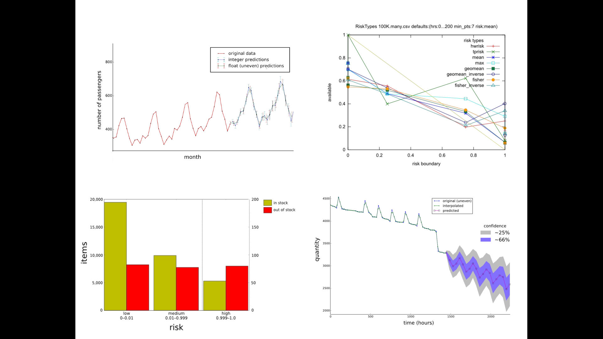

## Out of Stock Risk

Developed custom Holt-Winters (triple exponential) forecasting:

    * Custom algorithmic development:
        * can handle non-uniform data
        * heuristic to select optimal seasonalities
        * integrate with probabilistic model to better predict low count data
    * Implemented in numpy/scipy

*Currently in production use at Doba Inc*

[in-house project presentation](https://www.dropbox.com/s/k5niyn4kwm1jwze/OOS_Risk_Presentation.pdf?dl=0)

